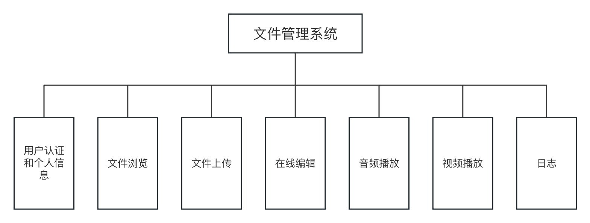

# 软件设计和开发报告

## 1 软件功能说明

该软件是一个文件管理系统，旨在帮助用户管理和浏览文件。以下是该软件的主要功能：

1. 用户认证和个人信息：
    - 用户可以登录系统，并显示其用户名在顶部导航栏中。
    - 用户个人信息页面（/profile）：用户可以查看和编辑个人信息。

2. 文件浏览：
    - 文件浏览页面（/files）：用户可以查看文件列表，并浏览文件夹层次结构。
    - 用户可以点击文件名或文件夹名称以进一步浏览其内容或子文件夹。

3. 文件上传：
    - 文件上传页面（/upload）：用户可以选择文件并将其上传到系统中的指定位置。

4. 在线编辑：
    - 在线编辑页面（/edit）：用户可以选择文件，并在浏览器中进行在线编辑。用户可以保存编辑后的文件。

5. 音频播放：
    - 音频播放页面（/audio）：用户可以选择音频文件，并在浏览器中播放音频。

6. 视频播放：
    - 视频播放页面（/video）：用户可以选择视频文件，并在浏览器中播放视频。

7. 日志
    - 日志页面（/log）：用户可以查看操作日志。

该软件的用户界面基于Vue和Bootstrap，以适应不同屏幕尺寸和设备。顶部导航栏和侧边栏提供了导航功能，使用户可以快速切换不同的功能页面。

后端采用Servlet，对前端的请求进行响应。

## 2 软件架构设计



用户认证和个人信息：负责用户认证和管理用户个人信息，包括身份验证、登录、注册、个人信息查看和编辑等功能。

文件管理：作为核心组件，负责管理整个文件系统，包括文件和文件夹的创建、删除、复制、移动等操作。

文件浏览：提供用户界面来浏览文件和文件夹，以树状结构展示文件夹层次和文件列表，并支持文件的预览和查看。

文件上传：允许用户选择文件并将其上传到系统中的指定位置，包括选择文件、上传进度显示和上传结果反馈等功能。

在线编辑：提供用户界面以在线编辑文件内容，包括选择文件、编辑器显示、保存编辑后的文件等功能。

音频播放：支持用户在浏览器中播放音频文件，包括选择音频文件、播放控制和音频进度显示等功能。

视频播放：支持用户在浏览器中播放视频文件，包括选择视频文件、播放控制、全屏显示等功能。

日志：允许用户查看操作日志。

## 软件架构设计

系统基于Vue+Servlet构建，通过接口进行前后端交互

1. 用户认证和个人信息：包括/Auth，/Login, /Register, /Profile接口，分别用来验证是否登录、登录、注册、查看个人信息
- 用户认证：通过JWT实现，以下是部分相关代码
```Java
String token = jwt.substring(7);
try {
    Claims claims = Jwts.parser()
            .setSigningKey(SECRET_KEY)
            .parseClaimsJws(token)
            .getBody();

    username = claims.getSubject();
    res.put("code", 200);
    res.put("username", username);
    response.getWriter().write(String.valueOf(res));
} catch (Exception e){
        res.put("code",405);
        response.getWriter().write(String.valueOf(res));
}
```
- 登录：从数据库中查询并设置JWT
部分代码如下：
```Java
connection = DBUtil.getConnection();

// 从请求参数中获取 username 和 password
String username_ = request.getParameter("username");
String password_ = request.getParameter("password");

// 构建查询语句
String query = "SELECT * FROM user WHERE username = ? AND password = ?";
statement = connection.prepareStatement(query);
statement.setString(1, username_);
statement.setString(2, password_);

// 执行查询
resultSet = statement.executeQuery();
```

- 注册：将数据添加到数据库中（添加之前查询用户名是否已经存在）
```Java
connection = DBUtil.getConnection();

// 从请求参数中获取 username 和 password
String username_ = request.getParameter("username");
String password_ = request.getParameter("password");

// 构建查询语句
String query = "INSERT INTO user (username, password) values (?, ?)";
statement = connection.prepareStatement(query);
statement.setString(1, username_);
statement.setString(2, password_);

// 执行查询
statement.executeUpdate();

JSONObject res = new JSONObject();
res.put("code", 200);
response.getWriter().write(String.valueOf(res));
```

- 查看个人信息
```Java
connection = DBUtil.getConnection();
// 构建查询语句
String query = "SELECT * FROM user WHERE username = ?";
statement = connection.prepareStatement(query);
statement.setString(1, username_);

// 执行查询
resultSet = statement.executeQuery(); 
```

2. 文件浏览：包括/Files接口，用来返回文件列表
```Java
connection = DBUtil.getConnection();
// 构建查询语句
String query = "SELECT * FROM user, file WHERE username = ? and user.id = file.user_id";
statement = connection.prepareStatement(query);
statement.setString(1, username);

// 执行查询
resultSet = statement.executeQuery();
```

3. 文件上传：包括/Upload接口，用于上传文件
```Java
// 获取上传的文件和路径参数
Part filePart = request.getPart("file");
String path = request.getParameter("path");


// 从文件名中提取文件名
String fileName = getFileName(filePart);

// 确定文件在服务器上的保存路径
// Path uploadPath = Paths.get("" + userid, path, fileName);
String uploadDirectory = getServletContext().getRealPath("/uploads");
uploadPath = Paths.get(String.valueOf(userid), path, fileName);
uploadPath_ = Paths.get(uploadDirectory, String.valueOf(userid), path, fileName);
uploadPath0 = Paths.get(path, fileName);


// 判断目录是否存在，如果不存在则创建
Path directory = uploadPath_.getParent();
boolean ok = false;
if (!Files.exists(directory)) {
   try {
      Files.createDirectories(directory);
      System.out.println("目录已创建：" + directory);
   } catch (IOException e) {
      System.err.println("无法创建目录：" + directory);
      e.printStackTrace();
   }
}


// 将上传的文件保存到服务器
saveFile(filePart, uploadPath_);
```

4. 在线编辑：包括/FileContent和/SaveFile接口，用于获取文件内容和保存修改后的文件内容
```Java
String path = jsonNode.get("path").asText();
int userid = jsonNode.get("userid").asInt();
String uploadPath = Paths.get(path).toString();
String uploadDirectory = getServletContext().getRealPath("/uploads/" + userid);
String uploadPath_ = Paths.get(uploadDirectory, path).toString();
response.setContentType("text/plain");
if (uploadPath_ != null && !uploadPath_.isEmpty()) {
   if (saveFileContent(uploadPath_, content)) {
      res.put("code", 200);
      response.getWriter().write(String.valueOf(res));
   } else {
      response.setStatus(HttpServletResponse.SC_INTERNAL_SERVER_ERROR);
   }
} else {
   response.setStatus(HttpServletResponse.SC_BAD_REQUEST);
}
```

5. 音频播放：包含/Audio接口，用于获取音频文件
```Java
String path = jsonNode.get("path").asText();
String uploadDirectory = getServletContext().getRealPath("/uploads");
Path uploadPath_ = Paths.get(uploadDirectory, path);
response.setContentType("audio/mpeg");
// 获取响应的输出流
try (FileInputStream fis = new FileInputStream(new File(uploadPath_.toString()));
   ServletOutputStream outputStream = response.getOutputStream()) {
   
   // 读取文件内容并写入输出流
   byte[] buffer = new byte[4096];
   int bytesRead;
   while ((bytesRead = fis.read(buffer)) != -1) {
      outputStream.write(buffer, 0, bytesRead);
   }
}
```

6. 视频播放：包含/Video接口，用于获取视频文件
```Java
String path = jsonNode.get("path").asText();
String uploadDirectory = getServletContext().getRealPath("/uploads");
Path uploadPath_ = Paths.get(uploadDirectory, path);
response.setContentType("video/*");
// 获取响应的输出流
try (FileInputStream fis = new FileInputStream(new File(uploadPath_.toString()));
   ServletOutputStream outputStream = response.getOutputStream()) {
   
   // 读取文件内容并写入输出流
   byte[] buffer = new byte[4096];
   int bytesRead;
   while ((bytesRead = fis.read(buffer)) != -1) {
      outputStream.write(buffer, 0, bytesRead);
   }
}
```


## 软件界面及功能展示

在这里展示了部分页面

登录：

注册：

浏览文件：

文件上传：

在线编辑：

音频播放：

视频播放：

查看日志：
